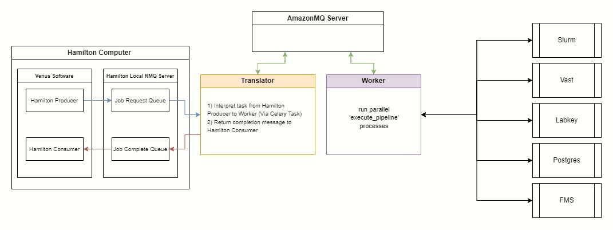

# celery-sandbox

From following: https://docs.celeryq.dev/en/stable/getting-started/first-steps-with-celery.html#rabbitmq

**Setup**:

Run RabbitMQ container:
```
docker run -d -p <server_port>:5672 rabbitmq
```

Run test celery consumer (`tasks.py`):
```
celery -A tasks worker --loglevel=INFO
```

Run test celery producer (`producer.py`)
```
python producer.py
```

**Celigo Pipline POC**:

*Setup*

The following 3 components run in separate processes, and can be distributed across a network.  They communicate using the RMQ on `dev-aics-tfp-002`.

* Run the hamilton consumer (models Venus listening for & consuming cell counts):
```python celigo_pipeline_poc/hamilton_consumer.py ```
* Run the mailman-translator (listens on local hamilton queue, recieves messages, converts them to celery messages for worker(s).  Recieves results from the workers, reduces to a cell count, transaltes and send that back to Venus):
```
python celigo_pipeline_poc/mailman_translatory.py 
```
* Run the celery worker
```
celery -A celery_consumer worker --loglevel=INFO
```

*Test*

In another teminal, run the hamilton producer (models Venus sending a file path list upon completing a scan):
```
python hamilton_producer.py
```

*Result*

Observe the following data flow, and notice how each component is decoupled, achieving a high degree of scalability and flexibility in how the system is architected:

